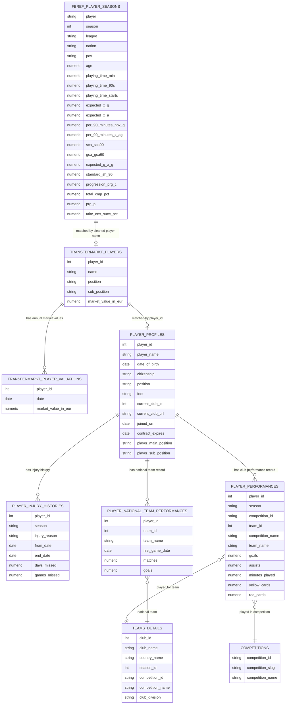

# Recruitment Analytics for CF Real Betis  
## Identifying Cost-Effective Rotation Striker Targets

## Project Overview

Real Betis finished 5th in La Liga during the 2024–25 season and secured qualification for the UEFA Champions League. With an increased fixture load next season (2025-26) and the potential departure of Cédric Bakambu, the club faces a need for additional attacking depth at centre-forward.

The objective is to identify a striker capable of serving as a rotation option behind Juan Camilo "Cucho" Hernández while also offering potential for future market value appreciation.

Given Real Betis' financial constraints, the club cannot consistently compete for established elite forwards. As a result, a data-driven recruitment process can help identify undervalued players before their market value rises.

Álvaro Ladrón de Guevara, Head Scout at Real Betis, has requested a shortlist of seven budget-conscious (≤ €15 mill) striker targets competing in Europe's top five leagues: the Premier League (UK), La Liga (Spain), Bundesliga(Germany), Serie A (Italy), and Ligue 1 (France).

This report applies statistical analysis and player profiling techniques to identify candidates who combine strong on-field performance, stylistic compatibility with Cucho Hernández, and realistic transfer feasibility.

## Data Structure

This project combines player-season performance data from FBref with market value, profile, injury, transfer, and national team data from Transfermarkt.

### Main Data Sources



## Methodology

The analysis follows four main steps:

1. **Candidate screening**  
   Filtered players by position, age, minutes played, and realistic market value.

2. **Statistical profiling**  
   Compared players using attacking, creative, pressing, and possession-related metrics.

3. **Cucho-style comparison**  
   Evaluated which players most closely resemble Cucho Hernández's statistical and tactical profile.

4. **Recruitment ranking**  
   Combined performance indicators with market value to identify cost-effective targets.

## Key Findings

Ignoring the Betis Priority Score and Cucho Fit Score, the players who most resemble Cucho Hernández stylistically are:

| Rank | Player | Why He Fits |
|---:|---|---|
| 1 | Santiago Castro | Mobile striker, active presser, involved outside the box |
| 2 | Christantus Uche | Strong physical profile, high work rate, disruptive movement |
| 3 | Nick Woltemade | Excellent link-up play and ball progression |
| 4 | Lucas Stassin | Strong attacking profile but more goal-focused |
| 5 | Breel Embolo | Physical, experienced, useful stylistic overlap |

## Top Recommendation

**Santiago Castro** appears to be the closest stylistic comparison to Cucho Hernández.

He is not just a penalty-box striker. His value comes from movement, pressing, link-up play, and involvement in attacking sequences outside the box.

## Tools Used

- R
- tidyverse
- ggplot2
- Quarto
- GitHub

## Repository Structure

```text
betis-striker-recruitment/
│
├── README.md
├── report/
│   └── betis_recruitment_report.pdf
│
├── images/
│   ├── workflow.png
│   ├── radar_castro.png
│   ├── radar_uche.png
│   └── radar_woltemade.png
│
├── scripts/
│   ├── data_cleaning.R
│   ├── similarity_model.R
│   └── visualizations.R
│
└── data/
