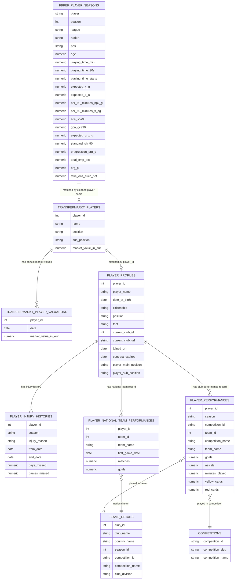
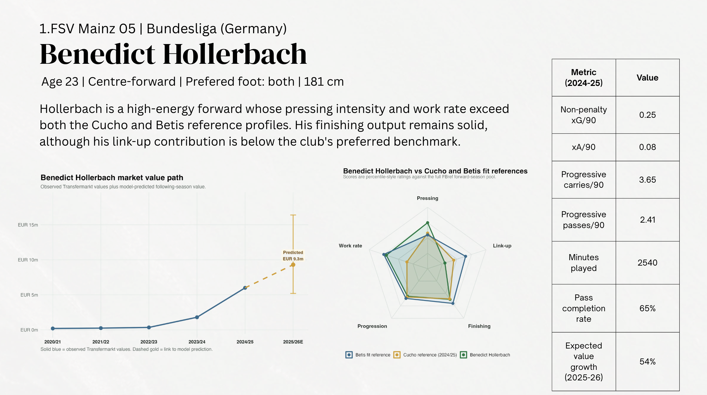

# Recruitment Analytics for CF Real Betis  
## Identifying Cost-Effective Rotation Striker Targets

## Project Overview

Real Betis finished 5th in La Liga during the 2024–25 season and secured qualification for the UEFA Champions League. With an increased fixture load next season (2025-26) and the potential departure of Cédric Bakambu, the club faces a need for additional attacking depth at centre-forward.

The objective is to identify a striker capable of serving as a rotation option behind Juan Camilo "Cucho" Hernández while also offering potential for future market value appreciation.

Given Real Betis' financial constraints, the club cannot consistently compete for established elite forwards. As a result, a data-driven recruitment process can help identify undervalued players before their market value rises.

Álvaro Ladrón de Guevara, Head Scout at Real Betis, has requested a shortlist of seven budget-conscious (≤ €15 mill) striker targets competing in Europe's top five leagues: the Premier League (UK), La Liga (Spain), Bundesliga(Germany), Serie A (Italy), and Ligue 1 (France).

This report applies statistical analysis and player profiling techniques to identify candidates who combine strong on-field performance, stylistic compatibility with Cucho Hernández, and realistic transfer feasibility.

## Data Structure

This project combines player-season performance data from FBref with market value, profile, injury, transfer, and national team data from Transfermarkt.

### Main Data Sources

## Executive Summary

### Key Findings

- The league coefficients suggest a clear Premier League premium. Holding player quality and context constant, forwards outside England’s top flight were expected to generate lower one-year market-value growth, supporting the idea that comparable Premier League players carry an additional market premium.

| League | Log coefficient | Growth multiplier vs Premier League | Approx. difference |
|---|---:|---:|---:|
| La Liga | -0.179 | 0.84x | 16.4% lower |
| Ligue 1 | -0.299 | 0.74x | 25.8% lower |
| Bundesliga | -0.281 | 0.76x | 24.5% lower |
| Serie A | -0.262 | 0.77x | 23.1% lower |

- Benedict Hollerbach emerged as the strongest overall candidate when balancing tactical fit, age profile, market value, and projected development.

- Santiago Castro demonstrated the closest stylistic resemblance to Cucho Hernández and offers substantial long-term upside.

- Lucas Stassin provides the strongest finishing profile among the shortlisted players.

- Christantus Uche stands out for his pressing intensity and defensive contribution.

- Lorenzo Colombo represents a lower-cost option capable of providing squad depth while maintaining resale potential.

### Recommended Shortlist

| Rank | Player | Betis Fit Score | Cucho Fit Score | 2024-25 Market Value (€M) | 2025-26 Projected Market Value (€M) | Recommendation |
|:---:|---|:---:|:---:|:---:|:---:|---|
| 1 | Benedict Hollerbach | 72 | 74 | 6 | 9 | Primary target |
| 2 | Santiago Castro | 63 | 53 | 12 | 23 | High-upside development option |
| 3 | Lucas Stassin | 73 | 62 | 5 | 13 | Finishing-focused alternative |
| 4 | Christantus Uche | 74 | 64 | 5 | 10 | Pressing and work-rate specialist |
| 5 | Lorenzo Colombo | 60 | 59 | 6 | 9 | Lower-cost depth option |

### Head Scout Recommendation

**Primary Recommendation: Benedict Hollerbach**

Hollerbach combines strong pressing intensity, high work rate, and an attacking profile that closely aligns with Real Betis' tactical requirements. His age, market value, and projected development trajectory make him the most attractive overall recruitment target among the shortlisted candidates.

**Alternative Recommendation: Santiago Castro**

If greater emphasis is placed on stylistic similarity to Cucho Hernández and long-term resale value, Castro represents the strongest alternative option.

## Candidate Profiles

### 1. Benedict Hollerbach

  

### 2. Santiago Castro
[radar chart]

### 3. Lucas Stassin
[radar chart]

### 4. Christantus Uche
[radar chart]

### 5. Lorenzo Colombo
[radar chart]
